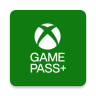

# Game Pass Plus

Multi-platform app to use Xbox Game Pass in its best possible way, leveraging the outstanding work of the folks over [Better xCloud](https://github.com/redphx/better-xcloud)

Most of the credits are to be given to [Better xCloud](https://github.com/redphx/better-xcloud) contributers an Microsoft themselves.

> **Important note**:  
> The folks over [Better xCloud](https://github.com/redphx/better-xcloud) have also an Android App on their own. It's different, but it serves the same purpose. Pick you poison!

## Disclaimer

Game Pass Plus is independently developed and is not affiliated with, authorized, endorsed, or licensed by Microsoft Corporation. "XBOX," "Game Pass," and all related brand are trademarks of Microsoft Corporation. This application utilizes and improves upon the service by integrating scripts from Better xCloud, an independent project aimed at enhancing the user experience of the Game Pass web version. Better xCloud source code is not included in this app but downloaded at runtime.

We acknowledge and appreciate the hard work of the Microsoft Corporation for providing the Game Pass service and the creators behind Better xCloud for their innovative contribution to enhance the experience. All rights and credits for the respective services and improvements go to their rightful owners.

By using Game Pass Plus, you acknowledge the above statements and credit attributions. This application is intended for personal use and aims to respect the rights and contributions of all parties involved.

## Available platforms

- Android
- Android TV
- Linux, macOS, Windows (tba)
- PWA (Android, Linux, macOS, Windows & iOS, tba)

## Features

- Native app feel for the platform of your choice
- All of the features from [Better xCloud](https://github.com/redphx/better-xcloud) ([more info](https://better-xcloud.github.io/features)):
- [Better xCloud](https://github.com/redphx/better-xcloud) auto-update
- UI tweaks so browsing feels more "console-like"

## TODO

### Interface

- Controller/Remote friendlyness:
  - [ ] Cookies pop-up
  - [ ] Login page
  - [ ] Game details media (Trailers and Screenshots) section
- Bugfixes/Workarounds:
  - [ ] [Hide video "posters"](https://stackoverflow.com/questions/18271991/html5-video-remove-overlay-play-icon) (Default video icon showing up for a second when a video/streaming is started)
  - [ ] Automatically press the "Press to start streaming" button that shows up when a game is started (only happening within the app, this never shows up on browser)

## Known issues

### Some "web browsery" stuff still appear

Yes, the app is based on the web version of [Games Pass](https://www.xbox.com/play), so web "browsery" stuff is to be expected. See the [TODO](#todo) section for what's planned regarding to these isssues

## Installation

### Android / Android TV

> Note: The `.apk` files are signed, but they're not (and won't ever) be available on the Google PlayStore. There's nothing shady in this app, but I doubt Microsoft would be happy to have a better app than their own on official distribution channels, plus I don't think its worth the hassle. F-Droid is envisageable though, depending on demand

#### Obtainium (automatic updates, recommended)

[Obtainium](https://github.com/ImranR98/Obtainium) is an app allowing you to get apps updates directly from sources.

To add Game Pass Plus to Obtainium, simply start Obtainium, hit the `+` icon, add `https://github.com/Moukrea/gamepassplus` to the source URL field and hit the `Add` button. You'll then only have to install it through the application list within Obtainium.

#### APK download (manual update)

> There won't be app update if you're using the manual installation
> 
Download the latest appropriate `.apk` file from the releases page for you device architecture (from here and nowhere else!). You can download it from the device itself or find your own way to send it there.

Install the `.apk` file like you would install any side loaded application.

Enjoy!

### Linux / Windows / macOS

> This section will be documented once their relative releases are made

## Technicalities

### Android / Android TV

The app is built using Java, not Kotlin.

#### Why is that?

Simply because the nearly 1to1 implementation using Kotlin wasn't working, it has JavaScript/Video playback issues that I couldn't get sorted out. Making the switch to Java solved all my issues.

#### It uses deprecated stuff!

Yes. Well this is my very first Android app and it's a bit of an odd one! Feel free to contribute!

### Linux / Windows / macOS

We are (I am) thinking about building the app using Go with Wails, or a simple Electron app with some React, it all depends on what works or not with minimal effort...

#### Why is that?

Well, it's just convenient! The app requires a browser to work properly as it's just http://www.xbox.com/play opened in a "native looking" window with a bunch of tweaks from [Better xCloud](https://github.com/redphx/better-xcloud) folks. Using WebView based technologies is just convenient as it allows us to build the app for three platforms at once.

### iOS

I have no knowledge in Swift nor own an iPhone and given the difficulty of sideloading apps into iOS devices, I highly doubt there will ever be a native app for iOS. Progressive Web App (PWA) will be the way.

## Credits

- Microsoft
- Better xCloud (redphx and contributors)
- Icons
  - [Cloud computing icons created by Freepik - Flaticon](https://www.flaticon.com/free-icons/cloud-computing)
  - [No internet icons created by Hight Quality Icons - Flaticon](https://www.flaticon.com/free-icons/no-internet)
  - [Error icons created by Freepik - Flaticon](https://www.flaticon.com/free-icons/error)
